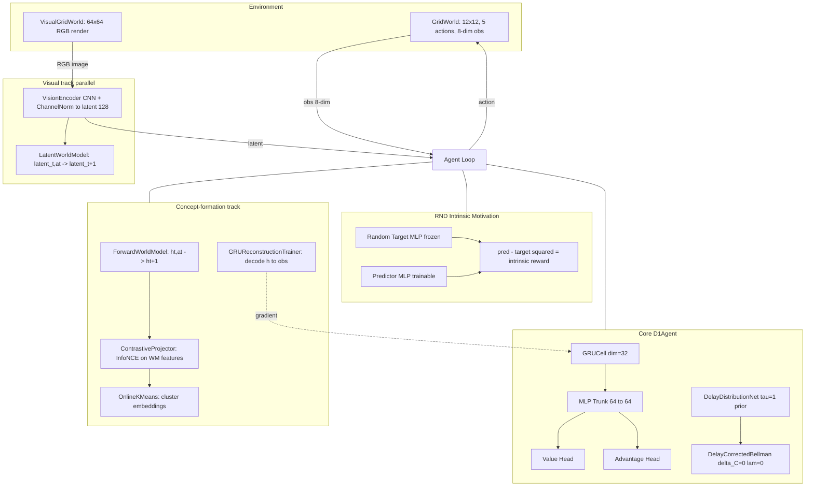
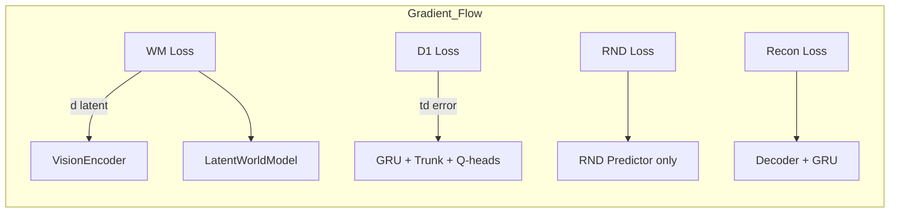

# Genesis — Phase 1

**An artificial-life agent driven by pure intrinsic curiosity, learning a stable value function and probing whether anything resembling *concepts* emerges from that process.**

Zero extrinsic reward. Zero task supervision. One 12×12 gridworld, one GRU policy net, one RND curiosity module, and a battery of falsifiable verification tests — including the negative ones.

---

## Verified claims (each has a re-runnable script)

| # | Claim | Evidence | Script |
|---|---|---|---|
| 1 | D1 value learning is stable, no divergence | TD error bounded (max ~12–35) over 14,700+ updates, multiple seeds, no NaN/inf | `gridworld_track/train.py` |
| 2 | RND curiosity is a real decaying signal | Intrinsic return decays ~370–535 → ~3–9 as novelty is exhausted, consistent across seeds | `gridworld_track/train.py` |
| 3 | RND+D1 explores more than random | Coverage delta +2–4pp in 2/3 single seeds; real but small (12×12 ceiling) | `gridworld_track/compare_coverage.py`, `sweep_coverage.py` |
| 4 | Forward world model learns real transition structure | Real-transition error **29–32× lower** than shuffled-transition error | `verify/verify_world_model.py` |
| 5 | Reconstruction auxiliary recovers discarded context info | NMI(h, context): D1-only = 0.010 → D1+recon = 0.062 (ceiling = 0.093) | `verify/verify_recon_context.py` |
| 6 | Vision encoder divergence found, root-caused, fixed | ChannelNorm after every conv; verified stable at scale | `verify/verify_encoder.py` |
| 7 | LayerNorm backward gradient bug found and fixed | Finite-diff ratio went from ~1300× (wrong sign) to 0.03–0.25% | `verify/verify_recon_context.py` (indirectly) |
| 8 | Contrastive on same-action pairing FAILS cluster test | NMI(clusters, context) = 0.0016 — kept as negative result | `verify/verify_contrastive_consequence_pairs.py` |

---

## Architecture



### Gradient isolation



No gradient flows between these branches — each tracks its own optimizer.

---

## What Phase 1 has NOT proven (explicit limitations)

- **No "understanding"** in any general sense — only that spatial/object info can survive in `h` given the right pressure.
- **No interpretable human-recognizable concepts** — the NMI numbers (0.062) are still far from clear categorical structure.
- **Coverage-vs-random** is a small, seed-dependent effect (12×12 grid ceiling limits headroom).
- **Delay net is bootstrapped** to a neutral `τ=1` prior — no real delay-labeled signal exists without D3's causal history buffer (deferred).
- **Nothing generalizes beyond this one gridworld** — no transfer test has been run.
- **Visual track** is numerically stable but has not been run through the same concept-formation gauntlet as the feature-vector track.

---

## Project structure

```
genesis_phase1/
├── README.md                       # this file
├── .gitignore
├── RESEARCH_LOG.md                 # full research narrative, bug postmortems, methodology
│
├── core/                           # shared building blocks (pure numpy, zero deps)
│   ├── networks_min.py             # vendored + fixed primitives (Linear, LayerNorm, MLP, GRUCell, Adam)
│   ├── delay_bellman.py            # CCPL's delay-corrected Bellman operator (vendored, unmodified logic)
│   ├── agent.py                    # D1Agent: GRU dueling-Q + D1 value learning
│   ├── replay_buffer.py            # minimal replay buffer
│   ├── rnd.py                      # Random Network Distillation intrinsic curiosity
│   ├── world_model.py              # forward world model on GRU hidden state
│   ├── contrastive.py              # InfoNCE contrastive projector (generalized positive_mask)
│   ├── clustering.py               # OnlineKMeans clustering
│   ├── recon_auxiliary.py          # GRUReconstructionTrainer (non-circular auxiliary loss)
│   └── logger.py                   # JSONL trajectory logger
│
├── gridworld_track/                # 8-dim observation track
│   ├── gridworld.py                # GridWorld environment
│   ├── train.py                    # main D1+RND+world_model+contrastive training loop
│   ├── compare_coverage.py         # coverage vs random baseline (single seed)
│   └── sweep_coverage.py           # multi-seed statistical sweep
│
├── visual_track/                   # image-observation track (parallel experiment)
│   ├── vision_encoder.py           # CNN encoder with ChannelNorm
│   ├── visual_gridworld.py         # renders gridworld to 64×64 RGB images
│   ├── visual_buffer.py            # replay buffer for image observations
│   ├── world_model_v2.py           # latent-space world model
│   └── train_visual.py             # visual training loop
│
├── verify/                         # standalone verification scripts, one claim each
│   ├── verify_world_model.py       # real vs shuffled transitions (32× gap)
│   ├── verify_world_model_v2.py    # visual-track equivalent
│   ├── verify_encoder.py           # CNN encoder sanity check
│   ├── verify_contrastive.py       # FAILED: raw-h collapse (kept for record)
│   ├── verify_contrastive_on_wm_features.py  # FIX: contrastive on WM features
│   ├── verify_contrastive_consequence_pairs.py # redesigned consequence-similarity pairing
│   └── verify_recon_context.py     # reconstruction recovers context info
│
├── scripts/                        # ad-hoc one-off diagnostics (informal)
│
└── logs/                           # gitignored — JSONL run outputs
```

---

## How to run

**Requirements:** Python 3.9+, NumPy. Zero other dependencies.

```bash
# Train the D1+RND agent on the gridworld track
python -m gridworld_track.train --episodes 200 --seed 0

# Train the visual track
python -m visual_track.train_visual --episodes 200 --render-size 64

# Verify a specific claim
python -m verify.verify_world_model
python -m verify.verify_recon_context
python -m verify.verify_contrastive_consequence_pairs

# Coverage comparison
python -m gridworld_track.compare_coverage
python -m gridworld_track.sweep_coverage --seeds 10
```

Use `--help` on any script for available arguments.

---

## Bugs found and fixed (summary)

Research log sections 4.1–4.4 document four bugs, each found by refusing to accept a plausible-looking curve:

1. **GRUPolicyNet.backward_update** — inverted gradient sign between value/advantage heads (slow divergence over ~5000 steps)
2. **LayerNorm.backward()** — used `B` (batch size) instead of `D` (feature dim) in coefficient; invisible until something needed to backprop *through* an MLP
3. **VisionEncoder** — unbounded activation growth (no normalization); fixed with ChannelNorm after every conv
4. **train_visual.py encoder_lr** — CLI argument accepted but silently never reached the optimizer; hardcoded default masked the real issue

Each fix was verified against a finite-difference baseline and regression-checked against known-good results.

---

## Methodological notes

- Every verification script states its pass/fail bar **before** running, not after.
- A clean-looking curve is not evidence — the vision-encoder divergence was *completely invisible* in the primary metric.
- Gradient correctness is not implied by a plausible loss curve. Finite-difference checks are standard practice.
- Negative results are kept in the repository (`verify_contrastive.py`) so the actual trajectory — wrong turns included — is reconstructable.

---

*For the full narrative including methodology and next-phase plans, see [RESEARCH_LOG.md](RESEARCH_LOG.md).*
