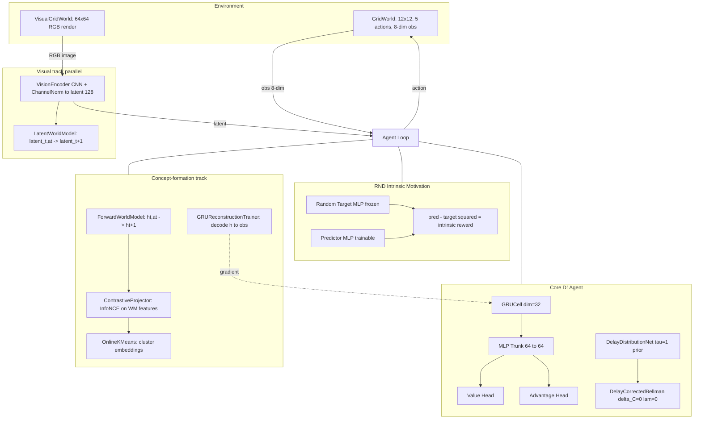
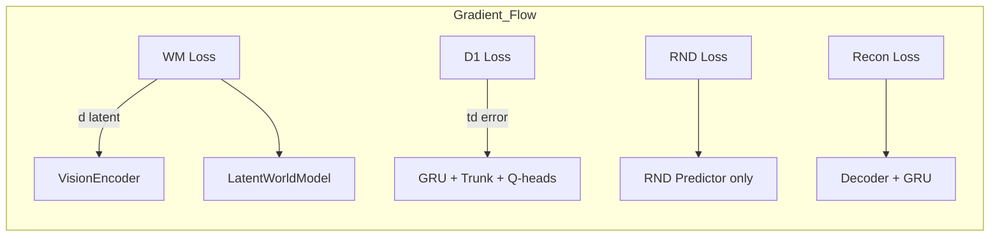
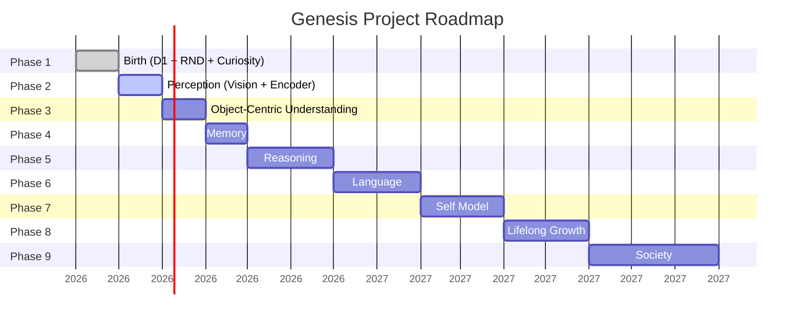

# GENESIS

**An artificial-life agent driven by pure intrinsic curiosity — no task reward, no supervision, just novelty-seeking and value learning.**

This is the start of a long research program. Phase 1 builds the minimal viable organism: a GRU policy net learning a stable value function via the delay-corrected Bellman operator (D1), driven to explore by Random Network Distillation (RND). A battery of falsifiable verification tests — including negative results kept on record — check every claim before it's reported as working.

**What makes this different:** every result below has a re-runnable script with a pass/fail bar declared *before* the experiment, not after. Four bugs were found and fixed during this phase, each discovered by refusing to accept a plausible-looking loss curve at face value. The bug postmortems are as important as the positive results.

---

## Table of Contents

- [Architecture](#architecture)
- [The story of Phase 1](#the-story-of-phase-1)
- [What has Phase 1 proven?](#what-has-phase-1-proven)
- [Research roadmap](#research-roadmap)
- [Project structure](#project-structure)
- [How to run](#how-to-run)
- [Methodology](#methodology)

---

## Architecture



### Gradient isolation



No gradient flows between these branches — each tracks its own optimizer. This isolation is deliberate: it lets us add or remove modules without destabilizing the core D1 learning loop.

---

## The story of Phase 1

### What was built

The organism has five components, assembled incrementally:

**1. The environment — `GridWorld`**
A 12×12 grid with walls and two object types (A, B). The agent receives an 8-dim hand-crafted feature vector — normalized position, distance to nearest object, object type one-hot, step count. No extrinsic reward. Ever. Reward is `0.0` for every step of every episode. The only learning signal is intrinsic.

**2. Value learning — `D1Agent`**
A GRU (dim 32) feeds a 2-layer MLP trunk into dueling Q-heads (value + advantage). Trained with D1 only — the delay-corrected Bellman operator with `delta_C=0` and `lam=0` (D2/D3/D4 explicitly not wired in this phase). The delay net is bootstrapped to a neutral `tau=1` prior because no real delay-labeled signal exists without the causal attribution machinery that belongs to a later phase.

**3. Intrinsic motivation — `RNDModule`**
Random Network Distillation: a fixed random target MLP and a trainable predictor MLP. Intrinsic reward = ‖predictor(obs) − target(obs)‖². Novel states produce high error; as the predictor learns, reward decays and the agent moves on.

**4. Concept-formation sub-track** (the main experimental work of this phase)
- **ForwardWorldModel** — predicts `h_{t+1}` from `(h_t, action)`. Purely additive to D1/RND.
- **ContrastiveProjector** — InfoNCE-style projection head, generalized to accept arbitrary positive masks.
- **OnlineKMeans** — simple online clustering on contrastive embeddings.
- **GRUReconstructionTrainer** — a non-circular auxiliary loss: decodes `h` back to the raw observation, backpropagating into the GRU itself.

**5. Visual track** (parallel experiment)
- **VisionEncoder** — CNN (3 conv layers + 1 residual block + projection) with ChannelNorm after every conv.
- **VisualGridWorld** — renders the same gridworld to 32×32 or 64×64 RGB images.
- **LatentWorldModel** — predicts `latent_{t+1}` from `(latent_t, action)`, operating in the encoder's representational space.

### What went wrong (four bugs, each worth detailing)

A research log that only reports successes is not a research log. These bugs materially changed what the earlier "working" results actually meant, and each was found by refusing to accept a plausible-looking curve at face value.

#### Bug 1: `GRUPolicyNet.backward_update` — inverted gradient sign

**Symptom:** Q-values diverged from bounded (~10s) to 6-figure magnitudes over ~5,000–15,000 updates. Initially misdiagnosed twice (blamed `gamma_eff` and target-tracking speed) before being isolated via a minimal single-sample gradient check.

**Root cause:** the advantage head received `-delta` while the value head received `+delta` for the *same* TD error. Since `q = v + a − mean(a)`, both heads must share the same gradient sign. The flip made them fight each other, producing slow-building divergence rather than a clean explosion — which is why it wasn't visible from loss curves alone.

**Fix:** both heads now receive `+delta`, consistent with the dueling-Q identity.

#### Bug 2: `LayerNorm.backward()` — batch-size/feature-dimension mismatch

**Symptom:** `GRUReconstructionTrainer`'s gradient into the GRU cell was wrong (finite-difference ratio ~99×, later isolated to ~1300× with the wrong sign in a cleaner test).

**Root cause:** LayerNorm normalizes across the feature dimension `D` (`x.mean(-1)`), but its backward formula used `1/(B·std)` — `B` (batch size), an unrelated axis — instead of `1/(D·std)`.

**Why it was invisible:** `dg`/`db_g` (the layer's own weight gradients) were unaffected. Every prior consumer of MLP — the world model, RND, contrastive projector, policy trunk — only needed its own weights to update correctly. None needed to backprop *through* an MLP into an earlier module. `GRUReconstructionTrainer` was the first thing that did, which is why this had never surfaced.

**Fix:** replaced `B` with `D` in the backward coefficient. Verified via finite-difference: broken version off by ~1300× with wrong sign; fixed version matches numeric gradient within 0.03–0.25%.

**Regression check:** reran `verify_world_model.py` (29.24×, consistent with pre-fix 31.8×) and the full training loop (TD error max 12.5, matches known-good baseline). The fix didn't disturb any previously-verified behavior.

#### Bug 3: `VisionEncoder` — unbounded activation growth (no normalization anywhere)

**Symptom:** in `train_visual.py`, intrinsic return collapsed to exactly `0.0000` by episode 40 — looked like clean curiosity exhaustion but was not. Latent norms had grown from ~O(1) to **500,000+** over 3,000 steps. RND's own reward normalization divides by a running std that grew in lockstep with the same blowup, silently producing a misleadingly clean-looking curve.

**Root cause:** no BatchNorm/LayerNorm/ChannelNorm anywhere in the conv stack. Gradient-norm clipping bounded the *applied update* but not the *activations themselves*.

**Fix:** added ChannelNorm (per-spatial-position normalization across channels) after every conv layer, including inside ResidualBlock. Chosen over BatchNorm because the codebase's small, non-i.i.d. batches don't suit cross-batch statistics.

**Verification:** the exact stress test that previously diverged from 0.45 to 56+ over 360 steps now converges monotonically to 0.53. Full 3000-step run confirmed latent norms stayed bounded at ~5.9–6.6 (vs. 500,000+ before).

#### Bug 4: `train_visual.py` — dead `encoder_lr` CLI argument

**Symptom:** the parameter was accepted, documented, and passed through `run()`, but never reached `VisionEncoder`'s optimizer. `backward()` called `_set_optim()` with no override, silently defaulting to a hardcoded `1e-5` regardless of what was requested.

**Fix:** `VisionEncoder.__init__` now stores `lr`; `_set_optim()` defaults to `self.lr`. A case of a documented safe default never actually being applied.

### What was found

#### Positive results

| # | Claim | Evidence | Script |
|---|---|---|---|
| 1 | D1 value learning is stable, no divergence | TD error bounded (max ~12–35) over 14,700+ updates, multiple seeds, no NaN/inf | `gridworld_track/train.py` |
| 2 | RND curiosity is a real decaying signal | Intrinsic return decays ~370–535 → ~3–9 as novelty is exhausted | `gridworld_track/train.py` |
| 3 | RND+D1 explores more than random | Coverage delta +2–4pp in 2/3 seeds; real but small (12×12 ceiling limits headroom) | `gridworld_track/compare_coverage.py`, `gridworld_track/sweep_coverage.py` |
| 4 | Forward world model learns real transition structure | Real-transition error **29–32× lower** than shuffled-transition error, across two independent runs | `verify/verify_world_model.py` |
| 5 | Reconstruction auxiliary recovers discarded context info | NMI(clusters-on-h, context): D1-only = 0.0101 → D1+reconstruction = 0.0618 (raw-obs ceiling = 0.0925) | `verify/verify_recon_context.py` |
| 6 | Vision encoder divergence — found, root-caused, fixed | ChannelNorm after every conv; verified stable at scale via finite-difference | `verify/verify_encoder.py`, `visual_track/train_visual.py` |
| 7 | LayerNorm gradient bug — found, fixed | Finite-difference: broken version off by ~1300× (wrong sign); fixed version matches within 0.03–0.25% | ad-hoc finite-difference scripts |

#### Negative result (kept because it's more informative than most positive ones)

**Does clustering on contrastive embeddings find concepts? No — not yet.**

The test was designed carefully: after training the contrastive projector, cluster the embeddings and check Normalized Mutual Information (NMI) against two label types:
- `NMI(clusters, action)` — expected to be high (training signal echo)
- `NMI(clusters, context)` — the real test, using a **local grid-content label computed directly from `env.grid`** (wall / object A / object B / nothing), completely independent of the observation vector and never seen by any trained component.

**Attempt 1 — same-action pairing:** `NMI(clusters, action) = 0.9988`, `NMI(clusters, context) = 0.0016`. The clusters are the action label, restated. No evidence of anything beyond echo.

**Attempt 2 — consequence-similarity pairing** (k-nearest neighbors by predicted next-state from the world model): `NMI(clusters, action)` dropped to `0.0038` — the redesign genuinely stopped echoing the action label. But `NMI(clusters, context) = 0.0135` — still near zero.

**Root-cause diagnostic:** clustering the **raw 8-dim observation directly** (no GRU, no world model, no contrastive projector) against the same context label gives `NMI = 0.0925` — higher than anything produced downstream. **The context information exists in the raw observation and is being destroyed by the GRU**, which has no incentive to preserve it. D1's scalar value objective doesn't need spatial context, so nothing prevents it from being discarded.

#### How the negative result led to a real fix

Given that diagnosis, the fix tested was **not** a supervised auxiliary loss on the context label (which would be circular) but a genuinely self-supervised one: a decoder trained to reconstruct the raw observation from `h`, with gradients flowing back into the GRU itself.

- Reconstruction loss trains cleanly: `0.675 → 0.0096` over the run.
- `NMI(clusters-on-h, context)`: **D1-only baseline = 0.0101 → D1+reconstruction = 0.0618** — a 6× improvement, recovering roughly two-thirds of the raw-observation ceiling, without the reconstruction loss ever seeing the context label.
- D1's own stability confirmed unaffected by the added gradient signal on the shared GRU weights.

**Honest interpretation:** this is evidence that context information *can* survive in `h` given the right pressure, and that pressure does not need to be told in advance what "context" means. It is **not** yet evidence of concepts in any strong sense — recovering 66% of a raw-feature ceiling via reconstruction is a long way from clusters that correspond to interpretable categories a human would recognize.

---

## What has Phase 1 proven?

### It has proven

1. A stable, non-diverging value-learning loop can run indefinitely on pure intrinsic reward (no task reward at all).
2. RND-driven curiosity is a real, measurable, decaying signal — not a placebo.
3. A forward world model can learn genuine one-step transition structure from an otherwise task-agnostic recurrent state.
4. Contrastive learning, done naively (same-action pairing), produces embeddings that are a restatement of the training label, not new structure — an important negative result, not a failure to hide.
5. The representational bottleneck for concept-relevant information is identifiable and specific: it's the GRU discarding information under a narrow (scalar-value) training pressure.
6. That bottleneck is at least partially fixable with a non-circular self-supervised pressure (reconstruction), without hand-labeling what the model should preserve.

### It has NOT proven

- **No "understanding"** in any general sense.
- **No interpretable human-recognizable concepts** — only that spatial/object information can survive with the right pressure.
- **Coverage-vs-random** is a small, seed-dependent effect (12×12 grid ceiling limits headroom) — real but not a strong result.
- **Delay net is bootstrapped** to a neutral `τ=1` prior — no real delay-labeled signal exists without D3's causal history buffer (deferred).
- **Nothing generalizes beyond this one gridworld** — no transfer test has been run.
- **Visual track** is numerically stable but has not been run through the same concept-formation tests as the feature-vector track.

---

## Research roadmap



### Phase 1 — Birth `██████████████████████████████████████████████████` 100%

An agent with no task reward, driven by intrinsic curiosity, learning a stable D1 delay-corrected value function over a toy gridworld. Core brain framework (GRU policy, RND, forward world model, contrastive projector, clustering probe, reconstruction auxiliary). All verification scripts in `verify/` with stated pass/fail bars. Bugs documented with finite-difference checks.

**Claim:** A stable, non-diverging value-learning loop can run on pure intrinsic reward alone. **Verified.** ✅

### Phase 2 — Perception `██████████████████████████████████████████░░░░░░░░` 85%

Vision encoder (CNN + ChannelNorm) that transforms raw RGB pixels into latent vectors, trained by world-model prediction loss. Visual track pipeline is numerically stable. VisualGridWorld renders the same environment to 64×64 images.

**Started but not complete:**
- Vision encoder is stable but hasn't been through concept-formation tests yet
- Need encoder ↔ world model co-training dynamics tuned
- Need latent-space analysis: do similar visual scenes cluster?

**Next:** Port the concept-formation test suite from the feature-vector track to the visual track.

### Phase 3 — Object-Centric Understanding `░░░░░░░░░░░░░░░░░░░░░░░░░░░░░░░░░░░░░░░░░░░░░░░░` 0%

Entities as persistent objects, not transient pixel clusters. The organism should recognize that an object moved, not just that a different pixel arrived.

- Object discovery via temporal coherence (objects move as wholes)
- Slot attention / object-centric representations
- Occlusion reasoning: an object behind a wall still exists
- Object permanence test: tracking through disappearance

**Pass bar:** Clusters in slot space should correlate with ground-truth object identity at NMI > 0.5.

### Phase 4 — Memory `░░░░░░░░░░░░░░░░░░░░░░░░░░░░░░░░░░░░░░░░░░░░░░░░` 0%

Beyond the GRU's recurrent state — dedicated memory architecture that stores, retrieves, and compresses experience.

- Episodic memory: store trajectory segments, retrieve by similarity
- Memory compression: abstract repeated patterns into schemas
- Memory consolidation: replay past experiences during "rest" periods
- Forward planning using retrieved memories

**Pass bar:** Agent with memory outperforms same-capacity agent without memory on a navigation task with a memorized layout.

### Phase 5 — Reasoning `░░░░░░░░░░░░░░░░░░░░░░░░░░░░░░░░░░░░░░░░░░░░░░░░` 0%

Causal inference: the organism attributes effects to their causes. This is the D3 integration point — the causal attribution machinery that the delay-corrected Bellman (D1) was always designed to work with.

- Causal history buffer (ICN) to track consequence delay
- Counterfactual reasoning: "what if I had taken a different action?"
- Causal discovery from passive observation
- Goal-directed planning using causal model

**Pass bar:** Agent distinguishes correlation from causation in a controlled environment (e.g., confounded reward signal).

### Phase 6 — Language `░░░░░░░░░░░░░░░░░░░░░░░░░░░░░░░░░░░░░░░░░░░░░░░░` 0%

Not human-level NLU — grounded language: associating symbols with percepts, actions, and internal states.

- Grounded vocabulary: learn that "up" maps to a specific action vector
- Instruction following: "go to the blue object" as a compositional command
- Communicating learned concepts to another agent
- Emergent communication in multi-agent setting

**Pass bar:** Agent correctly executes a novel 3-step compositional instruction it has never seen before.

### Phase 7 — Self Model `░░░░░░░░░░░░░░░░░░░░░░░░░░░░░░░░░░░░░░░░░░░░░░░░` 0%

The agent models itself: its own capabilities, limitations, current knowledge state, and uncertainty.

- Metacognitive monitoring: "do I know how to do this?"
- Epistemic humility: confidence-calibrated predictions
- Skill discovery: identifying reusable behavioral primitives
- Self-image: a persistent representation of "what kind of thing I am"

**Pass bar:** Agent that is uncertain about a task seeks information (active exploration) rather than taking a random guess.

### Phase 8 — Lifelong Growth `░░░░░░░░░░░░░░░░░░░░░░░░░░░░░░░░░░░░░░░░░░░░░░░░` 0%

The organism accumulates knowledge across tasks without catastrophic forgetting. Each new phase builds on, rather than overwrites, prior learning.

- Progressive network expansion
- Elastic weight consolidation / synaptic intelligence
- Curriculum learning: self-directed ordering of challenges
- Transfer learning to novel environments

**Pass bar:** Agent learns N tasks sequentially with final performance on task 1 comparable to a single-task agent trained only on task 1.

### Phase 9 — Society `░░░░░░░░░░░░░░░░░░░░░░░░░░░░░░░░░░░░░░░░░░░░░░░░` 0%

Multiple agents interact, share knowledge, specialize, and form the rudiments of an artificial culture.

- Multi-agent exploration: coverage vs. competition
- Knowledge transfer: one agent's learned policy seeded into another
- Role specialization: agents that develop complementary skills
- Cultural accumulation: knowledge that outlives any single agent

**Pass bar:** A society of N agents explores a large environment more efficiently than N independent agents.

### Immediate next steps

Ordered by dependency, not by ambition:

1. **Combine reconstruction + contrastive, retest clustering** — run contrastive projector (consequence-pair version) on top of `h` already shaped by reconstruction. Pass bar: NMI(clusters, context) should exceed both individual results (0.0618 and 0.0135).
2. **Scale up coverage-vs-random test** — rerun the sweep with a 20×20 or 30×30 grid and 10–20 seeds for a statistically defensible result.
3. **Visual track parity** — run the concept-formation gauntlet on visual-track `h`, using pixel-level ground truth as the independent label.
4. **Real delay learning (D1 + D3 integration)** — build D3's causal attribution machinery. Requires a substantially larger scope and its own pass/fail bar.

---

## Project structure

```
genesis_phase1/
├── README.md                       # this file (complete narrative)
│
├── core/                           # shared building blocks (pure numpy, zero deps)
│   ├── networks_min.py             # vendored primitives (Linear, LayerNorm, MLP, GRUCell, Adam)
│   ├── delay_bellman.py            # delay-corrected Bellman operator (vendored, unmodified)
│   ├── agent.py                    # D1Agent: GRU dueling-Q + D1 value learning
│   ├── replay_buffer.py            # minimal replay buffer
│   ├── rnd.py                      # Random Network Distillation intrinsic curiosity
│   ├── world_model.py              # forward world model on GRU hidden state
│   ├── contrastive.py              # InfoNCE contrastive projector (generalized positive_mask)
│   ├── clustering.py               # OnlineKMeans clustering
│   ├── recon_auxiliary.py          # GRUReconstructionTrainer (non-circular auxiliary loss)
│   └── logger.py                   # JSONL trajectory logger
│
├── gridworld_track/                # 8-dim observation track
│   ├── gridworld.py                # GridWorld environment
│   ├── train.py                    # main D1+RND+world_model+contrastive training loop
│   ├── compare_coverage.py         # coverage vs random baseline (single seed)
│   └── sweep_coverage.py           # multi-seed statistical sweep
│
├── visual_track/                   # image-observation track (parallel experiment)
│   ├── vision_encoder.py           # CNN encoder with ChannelNorm
│   ├── visual_gridworld.py         # renders gridworld to 64×64 RGB images
│   ├── visual_buffer.py            # replay buffer for image observations
│   ├── world_model_v2.py           # latent-space world model
│   └── train_visual.py             # visual training loop
│
├── verify/                         # standalone verification scripts, one claim each
│   ├── verify_world_model.py       # real vs shuffled transitions (32× gap)
│   ├── verify_world_model_v2.py    # visual-track equivalent
│   ├── verify_encoder.py           # CNN encoder sanity check
│   ├── verify_contrastive.py       # FAILED: raw-h collapse (kept for record)
│   ├── verify_contrastive_on_wm_features.py  # FIX: contrastive on WM features
│   ├── verify_contrastive_consequence_pairs.py # redesigned consequence-similarity pairing
│   └── verify_recon_context.py     # reconstruction recovers context info
│
├── scripts/                        # ad-hoc one-off diagnostics (informal)
│
└── logs/                           # gitignored — JSONL run outputs
```

---

## How to run

**Requirements:** Python 3.9+, NumPy. Zero other dependencies.

```bash
# Train the D1+RND agent on the gridworld track
python -m gridworld_track.train --episodes 200 --seed 0

# Train the visual track
python -m visual_track.train_visual --episodes 200 --render-size 64

# Verify a specific claim
python -m verify.verify_world_model
python -m verify.verify_recon_context
python -m verify.verify_contrastive_consequence_pairs

# Coverage comparison
python -m gridworld_track.compare_coverage
python -m gridworld_track.sweep_coverage --seeds 10
```

Use `--help` on any script for available arguments.

---

## Methodology

These are working principles established through Phase 1's actual mistakes, not written in advance — kept here so they're not forgotten on the next pass.

1. **Every verification script states its pass/fail bar before running, not after.** Several results (contrastive collapse, consequence-pairing's partial failure) only have value because the bar was fixed in advance — moving goalposts after seeing a number is how negative results get quietly reframed as positive ones.

2. **A clean-looking curve is not evidence.** The vision-encoder divergence was completely invisible in the primary metric (intrinsic return → 0.0000, which looked like *success*) and was only caught by directly inspecting latent magnitudes. Any metric that can be trivially satisfied by degenerate behavior (collapse, saturation) needs a second, independent check.

3. **Gradient correctness is not implied by a plausible-looking loss curve.** Two of the four bugs (the sign flip, the LayerNorm dimension bug) produced loss curves that looked directionally reasonable for a while before diverging, or produced no visible symptom until a different module needed the broken code path. Finite-difference checks against every new gradient path, not just "does the loss go down," is now standard practice.

4. **Negative results stay in the repository.** `verify_contrastive.py` (the failed same-action pairing attempt) is kept, not deleted. The project's actual trajectory — wrong turns included — must be reconstructable.
